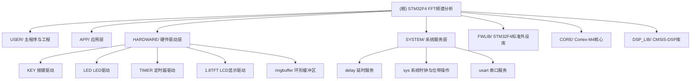

# STM32F4 FFT频谱分析仪表项目

## 变更记录 (Changelog)

| 日期 | 变更内容 | 来源 |
|------|---------|------|
| 2026-06-06 | 初始架构文档生成（全仓扫描，覆盖率约85%） | 架构师初始化 |

## 项目愿景

基于STM32F407 ARM Cortex-M4平台的FFT频谱分析仪表项目（电赛仪表题）。核心功能：通过ADC采集模拟信号(PA1)，利用CMSIS-DSP库进行1024点快速傅里叶变换(FFT)，将频谱结果在1.8寸TFT LCD上实时显示，同时通过串口(PA9/PA10, 115200)输出数据。按键K1触发单次FFT计算，LED D2指示系统运行状态。

**技术栈**: C语言裸机编程，Keil MDK5 IDE，ARM Compiler 5 (V5.06)，STM32F4标准外设库(STD Library)，CMSIS-DSP预编译库，无RTOS。

## 架构总览

本项目采用典型嵌入式裸机分层架构，自底向上分为5层：

```
层5: USER/        — 主程序入口、中断服务、Keil工程配置
层4: APP/         — 应用层模块（ADC数据处理、按键状态机、调度器、OLED显示）
层3: HARDWARE/    — 硬件驱动层（TFT LCD、按键、LED、定时器、环形缓冲区）
层2: SYSTEM/      — 系统服务层（延时、系统时钟、串口printf）
层1: FWLIB/CORE/DSP_LIB — 平台抽象层（STM32F4标准库、CMSIS-Core、CMSIS-DSP）
```

**控制流**: `main()` 初始化各模块后进入 `while(1)` 主循环，按键K1（PA0，WK_UP）事件驱动FFT计算，LED心跳闪烁指示系统存活。

**数据流**: 模拟信号(PA1) → ADC采集 → DMA双缓冲 → 应用层数据分拣 → FFT运算(arm_cfft_radix4_f32) → 取模(arm_cmplx_mag_f32) → 串口打印/TFT显示。

## 模块结构图



## 模块索引

| 模块路径 | 语言 | 职责 | 入口文件 | 测试目录 |
|---------|------|------|---------|---------|
| `USER/` | C, ASM | 主程序入口、中断服务、Keil工程 | `main.c` | 无 |
| `APP/` | C | 应用层：ADC数据分拣、按键状态机、调度器、OLED | `adc_app.c`, `scheduler.c` | 无 |
| `HARDWARE/` | C | 硬件驱动：TFT LCD、按键、LED、定时器、环形缓冲 | `1.8TFT/Lcd_Driver.c` | 无 |
| `SYSTEM/` | C | 系统服务：延时、时钟、串口printf | `delay/delay.c` | 无 |
| `FWLIB/` | C | STM32F4标准外设库（官方，不建议修改） | (vendor library) | 无 |
| `CORE/` | C, ASM | Cortex-M4启动文件与CMSIS核心头文件 | `startup_stm32f40_41xxx.s` | 无 |
| `DSP_LIB/` | Lib, H | ARM CMSIS-DSP预编译库（arm_cortexM4lf_math.lib） | `arm_cortexM4lf_math.lib` | 无 |

## 运行与开发

### 前置条件
- **IDE**: Keil MDK5 (uVision V5)
- **编译器**: ARM Compiler 5 (V5.06 update 7, 内部版本960)
- **目标芯片**: STM32F407VGTx (Cortex-M4, FPU, 1024KB Flash, 192KB RAM)
- **烧录调试**: J-Link (通过 JLinkSettings.ini 配置)
- **库依赖**: CMSIS-DSP 预编译库 `arm_cortexM4lf_math.lib`

### 工程文件
- 工程文件: `USER/DSP_FFT.uvprojx`
- 输出目录: `OBJ/` (已在 `.gitignore` 中忽略)
- 编译产物: DSP_FFT.axf, DSP_FFT.hex

### 编译与烧录
```bash
# 方式1: Keil IDE 打开工程
# 双击 USER/DSP_FFT.uvprojx，Keil MDK自动打开
# F7 编译，F8 下载

# 方式2: 命令行清理
.\keilkilll.bat
```

### 关键编译选项
- Use MicroLIB: 启用（串口printf重定向需要）
- FPU: 启用（Cortex-M4 硬件浮点单元）
- CMSIS-DSP: 链接 `arm_cortexM4lf_math.lib`（小端格式，M4带FPU版本）

### 硬件引脚分配
| 功能 | GPIO | 说明 |
|-----|------|------|
| 按键 K1 | PA0 | 下拉输入，WK_UP触发FFT |
| LED D2 | PA1 | 推挽输出，心跳闪烁 |
| 串口 TX | PA9 | USART1，复用推挽 |
| 串口 RX | PA10 | USART1，复用推挽 |
| ADC通道3 | PA3 | ADC1，模拟输入 |
| ADC通道4 | PA4 | ADC1，模拟输入 |
| ADC通道5 | PA5 | ADC1，模拟输入 |
| TFT SDA | PB15 | 模拟SPI数据 |
| TFT SCL | PB13 | 模拟SPI时钟 |
| TFT CS | PB12 | 片选 |
| TFT RST | PB14 | 复位 |
| TFT RS | PC5 | 命令/数据切换 |
| TFT BLK | PB1 | 背光控制 |

### 时钟配置
- 系统时钟: 168MHz (HSE 8MHz → PLL)
- APB1: 42MHz, APB2: 84MHz
- SysTick: HCLK/8 = 21MHz

## 测试策略

**当前状态**: 本项目无自动化测试框架和测试用例。作为电赛原型项目，采用"烧录-观察-验证"的手动测试方式。

**验证方法**:
1. **FFT功能验证**: 使用内置信号发生器（main.c中软合成的多频点混合信号：1x + 4x + 8x谐波 + DC偏置），通过串口输出FFT计算结果，对比预期频谱分布
2. **LCD显示验证**: 通过TFT屏幕上的文字提示确认系统启动
3. **时序验证**: TIM3定时器计数器测量FFT运算耗时，结果以毫秒显示在LCD和串口
4. **LED验证**: D2以约100ms周期闪烁（主循环t%10==0），确认系统未卡死

**测试缺口**:
- 无ADC外部信号源验证
- 无单元测试
- 无自动化CI

## 编码规范

- 语言: C (C89/C90 兼容，ARM Compiler 5)
- 缩进: Tab缩进
- 编码: GB2312/GBK（中文注释为乱码在UTF-8环境下显示）
- 命名: 蛇形命名 `snake_case`，外设函数名与ST官方库保持一致
- 注释: 关键算法有中文注释
- 模块文件: 每个模块 xxx.h + xxx.c 成对出现
- 全局变量: `g_` 前缀表示全局

## AI 使用指引

1. **修改代码前**: 确认目标文件所属模块层级，底层库(FWLIB/CORE/DSP_LIB)不建议修改
2. **新增功能**: 在APP/层添加应用逻辑，在HARDWARE/层添加驱动封装
3. **FFT相关**: 参考`arm_math.h`中的CMSIS-DSP函数声明，使用`arm_cfft_radix4_f32`等API
4. **避免**: 在FWLIB/中修改ST官方库文件，避免引入RTOS级依赖（当前为裸机架构）
5. **编译工具链**: 注意ARM Compiler 5的特有语法（如`__asm`内联汇编），不同于GCC ARM
